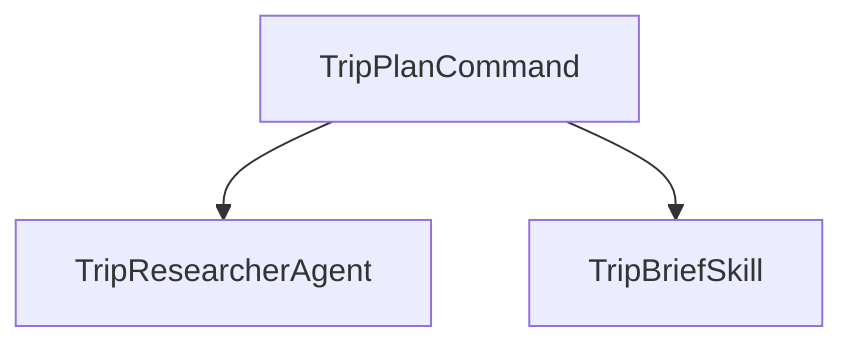

## 1. Stack
- No manifest present: no package.json / go.mod / pyproject.toml / Cargo.toml at repo root or in the one nested subfolder (`6_Claude_clode_Slash/`).
- Runtime is the Claude Code app itself — nothing is compiled or hosted (README.md:7-9).
- Content is plain Markdown files with YAML frontmatter: a slash command, a subagent, a skill (README.md:1-9, 56-60).

## 2. Directory map
| path | what lives there |
|---|---|
| `6_Claude_clode_Slash/` | project root Claude Code is opened in (`claude` run from here) |
| `6_Claude_clode_Slash/.claude/` | Claude Code auto-discovered config root |
| `6_Claude_clode_Slash/.claude/commands/` | slash command definitions (`trip-plan.md`) |
| `6_Claude_clode_Slash/.claude/agents/` | subagent definitions (`trip-researcher.md`) |
| `6_Claude_clode_Slash/.claude/skills/` | skill definitions, one dir per skill (`trip-brief/SKILL.md`) |
| `6_Claude_clode_Slash/README.md` | nested walkthrough of the three-piece wiring |
| `README.md` | repo-root overview, tags, run instructions |

## 3. Diagram

## 4. Component index
- [[TripPlanCommand]]
- [[TripResearcherAgent]]
- [[TripBriefSkill]]

## 5. Entry points
- Dev: `cd "6_Claude_clode_Slash" && claude`, then type `/trip-plan Lisbon 2026-08-15` (README.md:35-44)
- Prod: none — no build/host step; Claude Code is the runtime (README.md:7-9)

## 6. Conventions (observed)
- All three pieces are Markdown files with YAML frontmatter; no other source format (README.md:30-31, 56-60)
- Command frontmatter keys: `description`, `argument-hint`, `allowed-tools`, `model` (README.md:58)
- Agent frontmatter keys: `name`, `description`, `tools`, `model` (README.md:59)
- Skill frontmatter keys: `name`, `description` (README.md:60)
- `$ARGUMENTS` in a command file receives the text typed after the slash command (README.md:22-23)
- Files live under project-scoped `.claude/`; moving them to `~/.claude/` makes them available in every project (README.md:51-52)

## 7. Where things go
- Add a new slash command: create `.claude/commands/<name>.md` with `description`/`argument-hint`/`allowed-tools`/`model` frontmatter (README.md:58)
- Add a new subagent: create `.claude/agents/<name>.md` with `name`/`description`/`tools`/`model` frontmatter (README.md:59)
- Add a new skill: create `.claude/skills/<skill-name>/SKILL.md` with `name`/`description` frontmatter (README.md:60)
- Wire a command to a subagent/skill: reference the subagent/skill by name in the command's orchestration prompt (README.md:19-31)
- Make a command/agent/skill global instead of project-local: move its file(s) from `.claude/` to `~/.claude/` (README.md:51-52)
